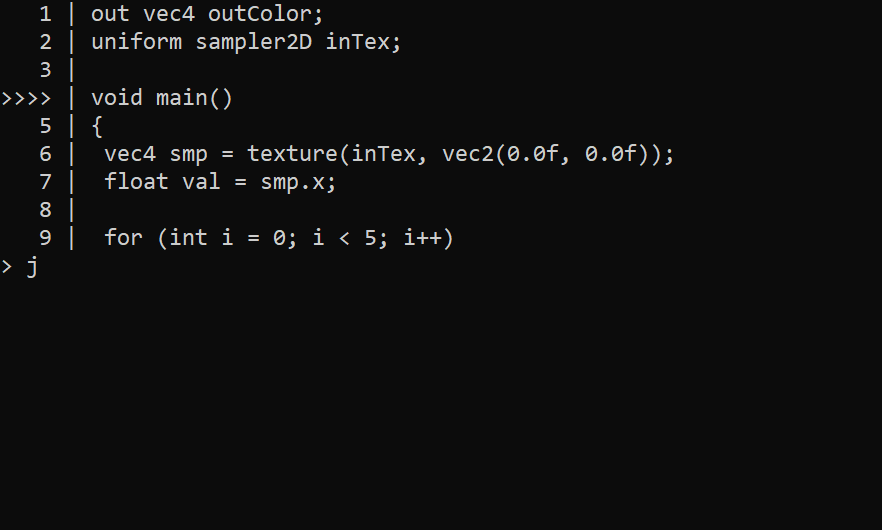

# ShaderDebugger

ShaderDebugger is a cross platform C++ library that can be used to debug GLSL and HLSL shaders.
It has various plenty of cool features: conditional breakpoints, step-by-step debugging, executing expressions on the fly, get variable values, etc...
We will describe each of those in more details later in this README file.

ShaderDebugger let's you see what actually happens in your shaders without having to use #ifs or some other tricks.

If you don't care about all of this and just want to see ShaderDebugger in action, check [SDBG](https://github.com/dfranx/sdbg) - a CLI shader debugger.

## How and why?
This library parses shaders into AST using [glsl-parser](https://github.com/dfranx/glsl-parser) & [hlslparser](https://github.com/dfranx/hlslparser).
The AST is then traversed to generate bytecode using the [aGen](https://github.com/dfranx/aGen) library.
The generated bytecode can then be executed using [BlueVM](https://github.com/dfranx/BlueVM).

ShaderDebugger was made to add debugging feature to [SHADERed](https://github.com/dfranx/SHADERed)
but it is MIT licensed which means that anyone can use, distribute, modify it, etc...

I encourage you to integrate it into your own project! Consider sharing your (or someone's) ShaderDebugger projects here: [link](https://github.com/dfranx/ShaderDebugger/issues/2)

## Integrating
Currently, the project has a very basic CMake file.
If you want to add ShaderDebugger to your project, just add the ShaderDebugger's source files:

For example, to clone ShaderDebugger:
```bash
git clone https://github.com/dfranx/ShaderDebugger.git
cd ShaderDebugger
git submodule init
git submodule update
```

You can then add ShaderDebugger to your project:
```cmake
add_subdirectory(./path/to/your/ShaderDebugger)
```

Variable `${SHADERDEBUGGER_SOURCE}` will now contain list of all required source files.

ShaderDebugger has only one dependency: **glm**.

## Example
```c++
std::string src = ... your shader code ...;

sd::ShaderDebugger dbg;
dbg.SetSource<sd::GLSLCompiler>(sd::ShaderType::Pixel, src, "main", NULL, sd::GLSL::Library());
// or dbg.SetSource<sd::HLSLCompiler>(sd::ShaderType::Pixel, src, "main", NULL, sd::HLSL::Library());

dbg.SetGlobalValue("iFactor", 0.7f);
dbg.SetGlobalValue("iColor", "vec3", glm::vec4(0.5f, 0.6f, 0.7f, 0.0f));

bv_variable ret = dbg.Execute(); // execute the entry function

glm::vec3 outColor = sd::AsVector<3, float>(*dbg.GetGlobalValue("outColor"));
printf("outColor = vec3(%.2f, %.2f, %.2f);\n", outColor.x, outColor.y, outColor.z);

bv_variable_deinitialize(&ret);
```

Or you can execute code line by line:
```c++
while (vs.Step()) {
    // get various info: GetCurrentFunction, GetFunctionStack, GetGlobalValue, GetLocalValue, etc...
}
```

You can also execute expressions using the `ShaderDebugger::Immediate`:
```c++
bv_variable result = dbg.Immediate("sin(a * 2.0f) + texture(tex, uv).x");
// result contains the result of the expression
bv_variable_deinitialize(&result);
```

## Screenshots
[SDBG](https://github.com/dfranx/sdbg) in action:
<p align="center">
    
</p>

## Documentation
I am working on a website which will host documentation for ShaderDebugger and SHADERed.
But until then, the description for most of the functions will be located here:
#### ShaderDebugger::SetSource\<Compiler\>(stage, source, entry, args, library)
Compiler is a class type which is used to compile the `source` into the bytecode.
Currently only pixel and vertex stages are supported, but more might be added in future.
`library` is a instance of `bv_library`. It contains all the object definitions (vec3, mat3, ...)
and all the function implementations (sin, cos, ...).
`sd::HLSLCompiler` and `sd::HLSL::Library()` are used for HLSL shaders, while 
`sd::GLSLCompiler` and `sd::GLSL::Library()` are used for GLSL shaders.

#### ShaderDebugger::Step()
Step 1 line.

#### ShaderDebugger::StepOver()
Steps one line but doesn't enter the functions used on that line.

#### ShaderDebugger::StepOut()
Execute the code until we leave current function.

#### ShaderDebugger::Immediate(expression)
Execute an expression and return it's result. Example: `bv_variable var = dbg.Immediate("acc + sin(tex.Sample(smp, uv).x)");`

#### ShaderDebugger::AddBreakpoint(line)
Add a basic breakpoint on the provided line.

#### ShaderDebugger::AddConditionalBreakpoint(line, condition)
Add a conditional breakpoint on the provided line. Example: `dbg.AddConditionalBreakpoint(17, "i > 10")`

#### ShaderDebugger::Execute(function, args)
This method runs some function defined in the shader code.
Example: `dbg.Execute("someRandomFunction", NULL)`.
This way you can test some other functions manually, without having to run the whole main()/entry function.

Call with no arguments to execute the entry function. Even though it is possible to render the whole scene using ShaderDebugger,
I suggest that you do not do that. It would take ages. ShaderDebugger/BlueVM need to be improved quite a lot for this to be plausible.

#### ShaderDebugger::GetCurrentFunction()
Returns the name of the function which is currently being executed.

#### ShaderDebugger::GetFunctionStack()
As the name suggest, this method returns the function stack (list of functions).

#### ShaderDebugger::GetCurrentFunctionLocals()
Get list of all local variable names used in the current function

#### ShaderDebugger::GetLocalValue(varname)
Get a value of the local variable that has the same name as the provided one.
Example: `bv_variable* var = dbg.GetLocalValue("tempColor")`.

#### ShaderDebugger::GetCurrentLine()
Get the number of line on which the `internal stepper` is located on.

#### ShaderDebugger::Jump(line)
Make the `internal stepper` jump to the provided line.

#### ShaderDebugger::Continue()
Run the code until we hit some breakpoint.

#### ShaderDebugger::SetSemanticValue(semantic, value)
Bind a value to a certain semantic string. Example: `dbg.SetSemanticValue("SV_Depth", bv_variable_create_float(0.1f));`

#### ShaderDebugger::AddGlobal(name)
Add a global variable definition. Example: `dbg.AddGlobal("gl_FragCoord");`

#### ShaderDebugger::SetGlobalValue(name, value)
Change global variable's value. Example: `dbg.SetGlobalValue("gl_FragCoord", "vec4", glm::vec4(100, 100, 0, 0));`

#### ShaderDebugger::IsDiscarded()
Check if the `discard;` command was called.

#### ShaderDebugger::GetCompiler()
Get the pointer to the compiler that was used to compile the shader.

#### Compiler::GetGlobals()
Get the list of all global variables.

#### Compiler::GetStructures()
Get the list of all user defined structures (their definition information - for example: members).

#### Compiler::GetFunctions()
Get the list of all user defined functions.

#### Compiler::GetLocals(func)
Get the list of all local variables inside of a function.

#### Compiler::GetLocalType(func, varname)
Get the type of the local variable in some function.

#### Other functions
There are plenty of other functions but I encourage you to download ShaderDebugger and explore them yourself!

## Partners / Sponsors
...

Contact: **dfranx00 at gmail dot com**

## Supporters
**Silver supporter(s):**
[Hugo Locurcio](https://github.com/Calinou)


## Support
Support the development of this project on Patreon: [](https://www.patreon.com/dfranx)

You can support the development of this project via **PayPal**: [](https://paypal.me/dfranx) 

My e-mail address for businesses (or if you just want to contact me):
**dfranx00 at gmail dot com**

## TODO
Here is the list of features/bugfixes:

### GLSL
- interface blocks
- local & structure member arrays
- fix ternary statement parsing

### HLSL
- classes / interfaces
- namespaces
- switch statement
- matrix<T, X, Y>, vector<T, X>
- initializer lists

### Both
- cubemaps
- some function implementations are missing (check HLSLLibrary.cpp / GLSLLibrary.cpp)
- expand all HLSL library functions to support matrices too (example: abs(some_matrix))
- fix matrixes, these don't work:
  - mat4 m; m[0].x = 1.0f;
  - mat4 m[4]; m[0][0][0];

## LICENSE
ShaderDebugger is licensed under MIT license. See [LICENSE](./LICENSE) for more details.